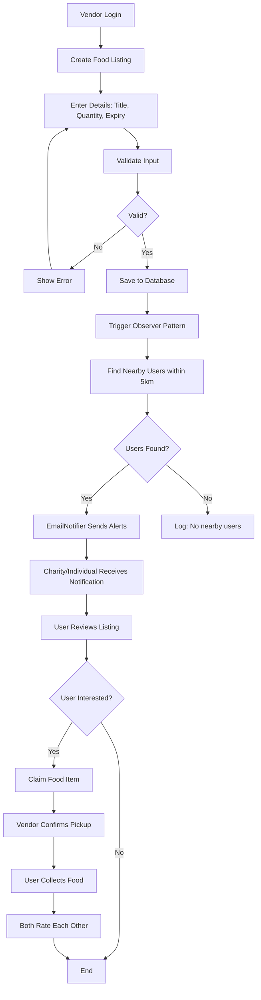
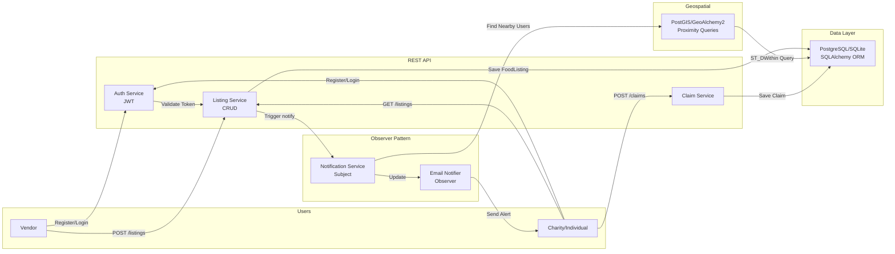
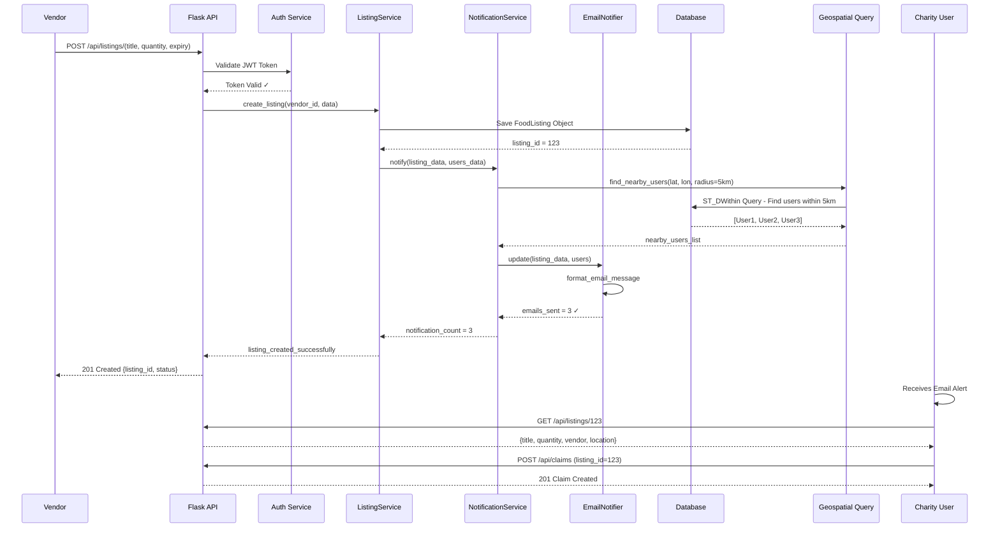
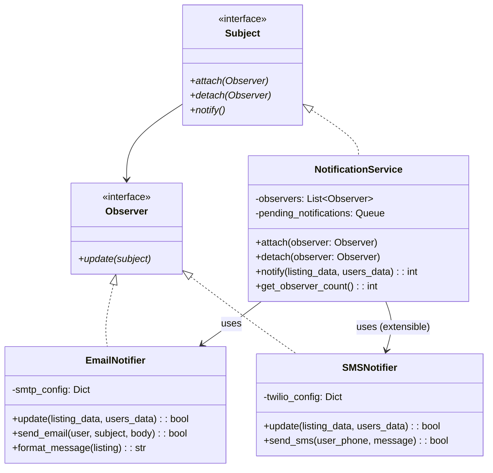
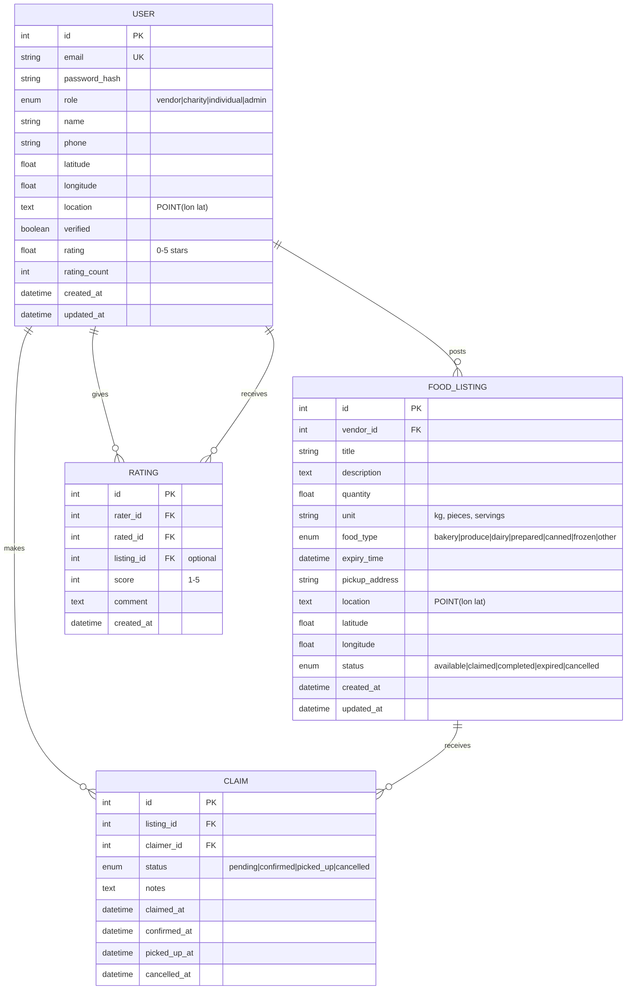
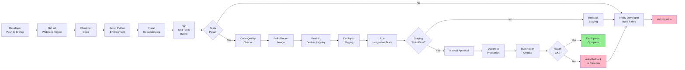

# UML Diagrams for Fresh-Share Platform

---

## 1. Activity Diagram: Food Listing & Notification Flow



---

## 2. Data Flow Diagram: System Information Flow



---

## 3. Sequence Diagram: Create Listing & Notify Flow



---

## Observer Pattern Class Diagram



---

## Database Entity Relationship Diagram



---

## System Architecture Diagram

```
┌─────────────────────────────────────────────────────────────────┐
│                    Fresh-Share Platform                          │
├─────────────────────────────────────────────────────────────────┤
│                                                                   │
│  ┌──────────────────────────────────────────────────────────┐  │
│  │              REST API Layer (Flask)                       │  │
│  │  ┌──────────┐ ┌──────────┐ ┌──────────┐ ┌────────────┐  │  │
│  │  │Auth      │ │Listing   │ │Claim     │ │User Routes│  │  │
│  │  │Routes    │ │Routes    │ │Routes    │ │           │  │  │
│  │  └──────────┘ └──────────┘ └──────────┘ └────────────┘  │  │
│  └──────────────────────────────────────────────────────────┘  │
│                           │                                      │
│  ┌────────────────────────▼──────────────────────────────────┐  │
│  │            Service Layer                                   │  │
│  │  ┌──────────────────────────────────────────────────────┐ │  │
│  │  │ListingService                                        │ │  │
│  │  │ - create_listing()  ──►  Trigger Observer Pattern   │ │  │
│  │  │ - update_listing()                                  │ │  │
│  │  │ - search_listings()  ──►  Geospatial Queries        │ │  │
│  │  │ - notify_nearby_users()                             │ │  │
│  │  └──────────────────────────────────────────────────────┘ │  │
│  └────────────────────────▲──────────────────────────────────┘  │
│                           │                                      │
│  ┌────────────────────────┼──────────────────────────────────┐  │
│  │      Observer Pattern Implementation                      │  │
│  │  ┌──────────────────────────────────────────────────────┐ │  │
│  │  │NotificationService (Subject)                         │ │  │
│  │  │  - observers: [EmailNotifier, ...]                  │ │  │
│  │  │  - notify(listing, users)                           │ │  │
│  │  │      └─► For each user: EmailNotifier.update()      │ │  │
│  │  └──────────────────────────────────────────────────────┘ │  │
│  └─────────────────────────────────────────────────────────────┘  │
│                           │                                      │
│  ┌────────────────────────▼──────────────────────────────────┐  │
│  │            Data Layer (ORM)                               │  │
│  │  ┌──────────────────────────────────────────────────────┐ │  │
│  │  │SQLAlchemy Models                                     │ │  │
│  │  │ - User, FoodListing, Claim, Rating                  │ │  │
│  │  │ - GeoAlchemy2 for geospatial queries                │ │  │
│  │  └──────────────────────────────────────────────────────┘ │  │
│  └────────────────────────▲──────────────────────────────────┘  │
│                           │                                      │
│  ┌────────────────────────┼──────────────────────────────────┐  │
│  │        Database (PostgreSQL / SQLite)                     │  │
│  │  - users, food_listings, claims, ratings                │  │
│  │  - PostGIS extension for proximity queries              │  │
│  └────────────────────────────────────────────────────────────┘  │
│                                                                   │
└─────────────────────────────────────────────────────────────────┘
```

---

## Technology Stack Overview

```
┌─────────────────────────────────────────────┐
│         Fresh-Share Platform Stack          │
├─────────────────────────────────────────────┤
│                                             │
│  Frontend: (Future) React/Vue.js            │
│  ├─ Components & State Management           │
│  └─ REST API Consumer                       │
│                                             │
│  Backend: Python + Flask 3.0                │
│  ├─ REST API (Blueprint routing)            │
│  ├─ JWT Authentication                      │
│  └─ Observer Pattern (Notifications)        │
│                                             │
│  Database: PostgreSQL 14 + PostGIS          │
│  ├─ Relational Data (SQLAlchemy ORM)        │
│  └─ Geospatial Queries (ST_DWithin)        │
│                                             │
│  Cache: Redis (optional)                    │
│  └─ Notification queuing                    │
│                                             │
│  API Documentation: Swagger/Flasgger        │
│  └─ Auto-generated from Flask route docs    │
│                                             │
│  Testing: pytest (10 test cases)            │
│  ├─ Unit tests (Models, Services)           │
│  ├─ Integration tests (API endpoints)       │
│  └─ Observer pattern tests                  │
│                                             │
│  Deployment: Docker                         │
│  ├─ Multi-stage build (test + prod)         │
│  ├─ docker-compose.yml (app + db + redis)   │
│  └─ Environment-configurable                │
│                                             │
│  Version Control: Git + GitHub              │
│  └─ Clean commit history                    │
│                                             │
└─────────────────────────────────────────────┘
```

---

## 8. CI/CD Workflow Pipeline



**CI/CD Pipeline Stages:**

1. **Trigger:** Developer pushes code to GitHub
2. **Build:** Checkout, setup Python, install dependencies
3. **Test:** Run pytest (10 test cases)
4. **Quality:** Code quality checks
5. **Docker:** Build and push Docker image
6. **Staging:** Deploy to staging environment with integration tests
7. **Approval:** Manual gate for production deployment
8. **Production:** Deploy to production with health checks
9. **Rollback:** Automatic rollback if health checks fail

**Tools:**
- **Version Control:** GitHub
- **CI/CD:** GitHub Actions (configurable)
- **Testing:** pytest
- **Container Registry:** Docker Hub or private registry
- **Monitoring:** Health check endpoints
